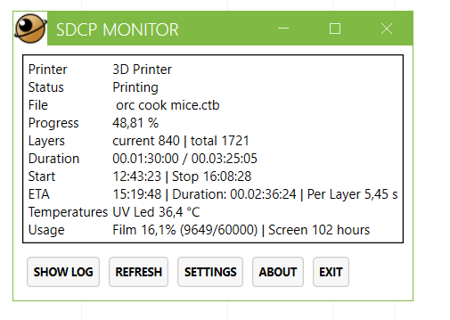
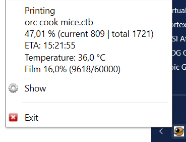
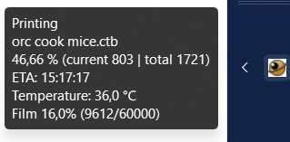

# SdcpMonitor
SdpcMonitor allows you to monitor the print progress of the Elegoo Saturn 4 Ultra **without the need of Chitubox and the Chitubox manager**.
It is a small application, that adds a tray icon to your Windows taskbar, so you can easily check the status of your print.

It communicates with the printer via the [SDCP protocol by Chitubox](https://github.com/cbd-tech/SDCP-Smart-Device-Control-Protocol-V3.0.0/blob/bdbeedbad90d825fb67fae49f1316f41b97a1aa3/SDCP(Smart%20Device%20Control%20Protocol)_V3.0.0_EN.md)

*It may possibly also work with the Elegoo Mars 5 Ultra, as I suspect that will also use the SDCP protocol, given that the Chitubox manager also works with it.*

**Disclaimer: This is still a work in progress...**

Application:

Tray icon menu

Tray icon tooltip

